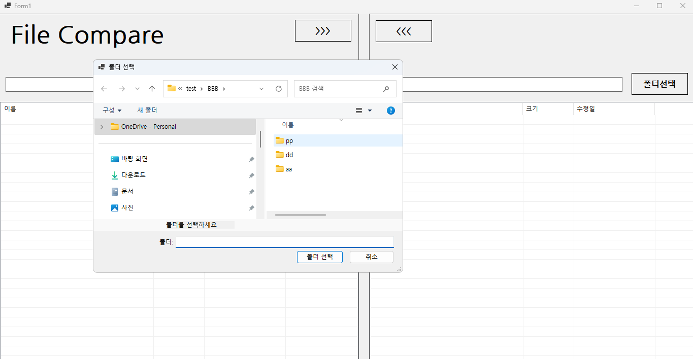
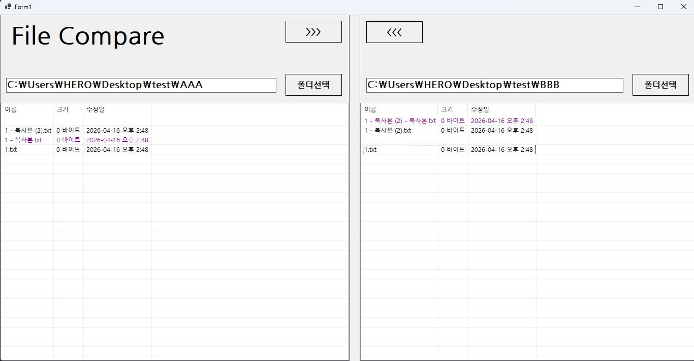
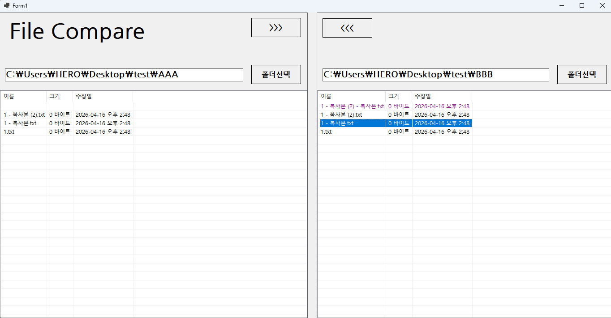
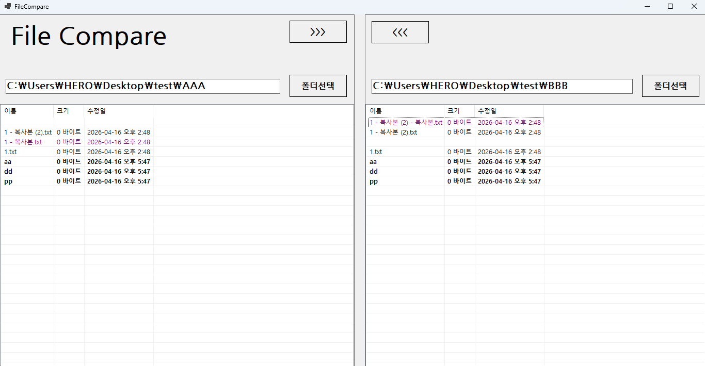

# (C# 코딩) 파일 비교 프로그램

## 개요
- C# 프로그래밍 학습
- 1줄 소개: 버거와 추가옵션을 원하는 대로 주문하는 화면
- 사용한 플랫폼:
    - C#, .NET Windows Forms, Visual Studio, GitHub
- 사용한 컨트롤: 
    - GroupBox, RadioButton, CheckBox, Button, Label
- 사용한 기술과 구현한 기능:
    - 컨트롤 배치와 기본적인 속성 설정
    - 선택한 항목 추출 기능 구현
    - UI 구성과 주문하기, 초기화 버튼의 구현
    - 아무것도 선택하지 않고 주문하기 버튼을 누르면 오류 메시지 표시
    - MessageBox 보다는 Label 컨트롤을 활용하여 오류 메시지 표시
    - 마우스 없이 키보드 입력만으로 주문이 가능하게 만들기

# 각 과제별 실행 화면

## 실행 화면 (과제1)

 

- 과제 내용
    - 컨트롤 배치와 기본적인 속성 설정
    - 선택한 항목 추출 기능 구현
    - UI 구성과 주문하기, 초기화 버튼의 구현

- 구현 내용과 기능 설명
    - 버거 종류와 추가 옵션을 선택할 수 있는 UI 구성
    - 주문하기 버튼을 클릭하면 총 가격을 표시하고 선택이 초기화되는 기능 구현
    - 초기화 버튼을 클릭하면 모든 선택이 초기화되는 기능 구현

## 실행 화면 (과제2)

 

- 과제 내용
    - 아무것도 선택하지 않고 주문하기 버튼을 누르면 오류 메시지 표시
    - MessageBox 보다는 Label 컨트롤을 활용하여 오류 메시지 표시

- 구현 내용과 기능 설명
    - 주문하기 버튼을 클릭했을 때, 버거 종류가 선택되지 않은 경우 오류 메시지를 Label 컨트롤에 표시하는 기능 구현
    - 오류 메시지가 표시된 상태에서 버거 종류를 선택하면 오류 메시지가 사라지는 기능 구현
    - 추가 옵션만 선택한 상태에서 주문하기 버튼을 클릭했을 때도 오류 메시지가 표시되는 기능 구현

## 실행 화면 (과제3)

 

- 과제 내용
    - 마우스 없이 키보드 입력만으로 주문이 가능하게 만들기
    - Tab을 이용하여 GroupBox 사이를 이동하기
    - 방향키를 이용해서 선택 아이템 사이를 이동하기
    - 스페이스바를 이용해서 아이템 선택하기
    - Enter키로 버튼을 누르기

- 구현 내용과 기능 설명
    - Tab 키를 이용하여 GroupBox 사이를 이동할 수 있도록 설정
    - 방향키를 이용하여 버거 종류와 추가 옵션 사이를 이동할 수 있도록 설정
    - 스페이스바를 이용하여 현재 선택된 아이템을 선택할 수 있도록 설정
    - Enter 키를 이용하여 주문하기 버튼과 초기화 버튼을 누를 수 있도록 설정

## 실행 화면 (과제4)

 

- 과제 내용
    - RadioButton과 CheckBox에서 원하는 항목을 선택하면 그 즉시 정보들이 업데이트 되도록

- 구현 내용과 기능 설명
    - 버거 종류를 선택할 때마다 총 가격이 업데이트 되도록 구현
    - 추가 옵션을 선택할 때마다 총 가격이 업데이트 되도록 구현
    - 주문하기 버튼을 클릭했을 때, 총 가격이 정확하게 계산되어 표시되는 기능 구현